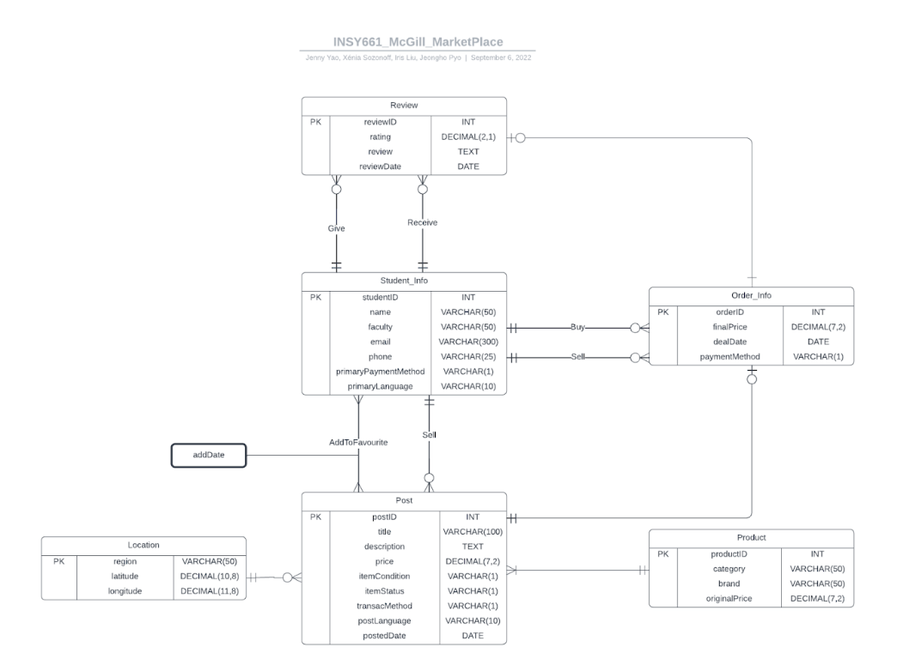

# McGill-Virtual-Trading-Platform
## Description
This project aims to create "McGill Marketplace," an online trading platform that allows students to buy and sell products. It ensures a secure transaction environment through the use of university email addresses for login. The project is expected to significantly impact the student community.  
There are four steps. The first step involves designing the database, which includes creating an ER diagram, defining a data dictionary, and developing a rational schema. Following this, we simulate the operation by building the database with SQL, inserting mock data. Subsequently, we crafted SQL queries to mimic data retrieval in user scenarios. Finally, we showcased the results by developing a basic webpage using HTML and CSS.

## Database Design
The final database comprises 6 entities and 44 attributes. The ER diagram shown below outlines the relationships between the tables, as well as the associations of entities and attributes.

 

 ER Diagram

 

Then, we created the database using SQL, such as  
<pre>
CREATE TABLE Student_Info (  
	studentID INT NOT NULL,  
	name varchar(50) NOT NULL,  
	faculty varchar(50) NOT NULL,  
	email varchar(300) NOT NULL,  
	phone varchar(25) NOT NULL,  
	primaryPaymentMethod varchar(1) NOT NULL,  
	primaryLanguage varchar(10) NOT NULL,  
	PRIMARY KEY (studentID));
</pre>
 

## Sample Queries
To simulate the operation, queries are divided in four genre: Features, Client, Decision and Retail. Below is an example query from Features.  
 
Scenario:
The ranking section of the website shows the best users according to the H-index.
The Use of H-index: Students who have posted or bought many items will have lots of reviews, but the ratings are not necessarily high; Students with high average ratings might just be because they only sold or bought one or two items. Thus, it is less reasonable to identify the best users by counting their transactions or calculating their average ratings. Thus, McGill Marketplace wants to use the H-index to rank the best users. H-index equals the number, H, of reviews for this student which have a rating score of at least H.
H-index is calculated by following these steps:
1. For each student, find their ratings and the number of times they got at least that rating.
2. If Ron got at least 4.0 3 times and at least 3.0 4 times, then his H-index should be 3.
3. If Hermione got at least 4.0 4 times and at least 3.0 4 times, her H-index should be 4.  
<pre>
SELECT studentID, name, MAX(min_score) AS `H-index`
  FROM
  (
    SELECT temp_a.studentID, temp_a.name, COUNT(temp_a.rating) as numHigherRating, temp_b.rating,
    CASE WHEN COUNT(temp_a.rating) < temp_b.rating THEN COUNT(temp_a.rating) ELSE temp_b.rating END AS min_score
      FROM(
        SELECT s.studentID, s.name, r.rating, COUNT(r.orderID) AS num
        FROM Student_Info s, Review r
        WHERE s.studentID=r.toStudent
        GROUP BY s.studentID, r.rating
          ) temp_a
          ,
    Review temp_b
    WHERE temp_a.studentID = temp_b.toStudent AND temp_a.rating >= temp_b.rating
    GROUP BY temp_a.studentID, temp_b.rating
  ) temp_c
GROUP BY studentID
ORDER BY `H-index` DESC
</pre>

## Demonstration Webpage
Finally, we created a demo webpage to present the functionalities of the platform using HTML and CSS. However, the webpage is no longer functional. The screenshot below can represent its basic appearance.

 

